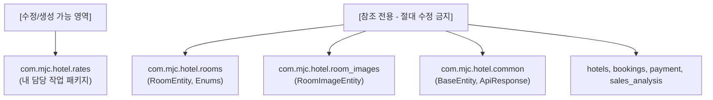
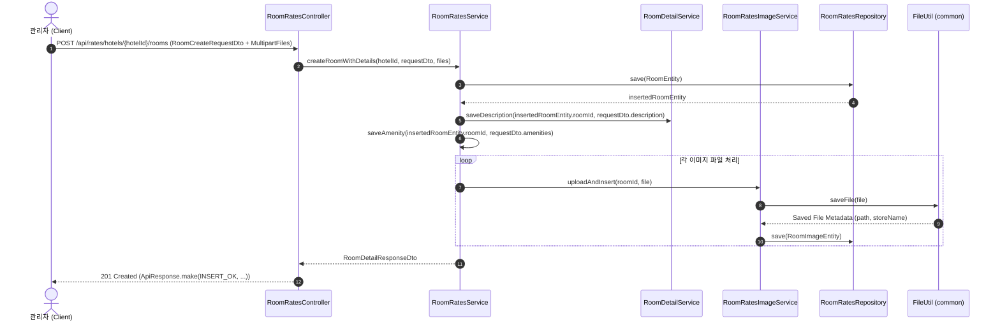
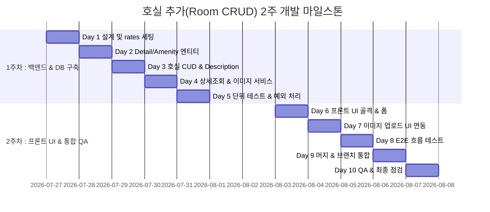

# 📋 [기획서] 호텔 호실 관리(Room CRUD) 기능 2주 상세 구현 기획서

> **문서 버전**: v1.1 (RoomType 수정 및 description 전용 테이블 추가 반영)  
> **작성 일자**: 2026-07-23  
> **대상 패키지**: `com.mjc.hotel.rates` (단독 격리 작업 영역)  
> **관련 문서/참고자료**: `C:\git\mjc_b-hotel-reservation_doc\docs\ljh\호실추가\호실 추가 기획서.txt`, `hotel_erd (6).sql`

---

## 1. 프로젝트 개요 및 배경 (Executive Summary)

### 1.1 기획 배경 및 목적
MJC 호텔 예약 시스템의 성공적인 서비스를 위해, 호텔 관리자가 자사 호텔에 소속된 **객실(호실) 매물을 손쉽게 등록, 조회, 수정, 삭제(CRUD)**하고, **상세 설명 입력**, **편의시설 옵션 토글** 및 **객실 사진 업로드**를 수행할 수 있는 관리자 전용 대시보드 API 및 프론트엔드 연동 화면을 개발합니다.

### 1.2 핵심 제공 기능
1. **호텔별 호실 CRUD**: 지정된 `hotelId` 컨텍스트 내에서 호실 등록/조회/수정/삭제.
2. **객실 속성 관리**: 호실 번호, 층수, 면적, 기본 1박 요금, 성인/어린이 최대 수용 인원 설정.
3. **Enum 옵션 연동**: 객실 타입(`RoomType`), 객실 상태(`RoomStatus`), 전망 옵션(`RoomViewOption`), 침대 옵션(`RoomBedOption`) 설정.
4. **객실 상세 설명(Description) 관리**: 기존 `RoomEntity` 수정 없이 `rates` 패키지 전용 `room_details` 테이블(1:1)을 신규 구축하여 저장 및 조회.
5. **편의시설(Amenity) Upsert**: Wi-Fi, TV, 욕조, 조식 포함, 금연 등 7가지 혜택 1:1 토글 매핑.
6. **객실 이미지 관리**: 드래그 앤 드롭 방식을 통한 다중 객실 이미지 업로드, 썸네일 조회, 개별 삭제 기능.

---

## 2. 작업 범위 제약사항 (Absolute Principles & Rules)

> ⚠️ **[최우선 절대 원칙] 패키지 격리 및 타 팀 코드 수정 금지**



1. **단독 수정 범위**: 모든 신규 코드 작성, 파일 생성, 기존 코드 수정은 오직 `com.mjc.hotel.rates` 패키지 내부에서만 수행합니다.
2. **참조 전용 범위 (Read-Only)**:
   - `com.mjc.hotel.rooms` (`RoomEntity`, `IRoom`, `RoomType`, `RoomStatus`, `RoomViewOption`, `RoomBedOption` 등)
   - `com.mjc.hotel.room_images` (`RoomImageEntity`, `IRoomImage` 등)
   - `com.mjc.hotel.common` (`BaseEntity`, `ApiResponse`, `ResponseCode`, `FileUtil` 등)
   - 공용 테이블(`hotels`, `users`, `bookings` 등) 관련 다른 팀원 소스코드
3. **AGY 바이브 코딩 프롬프트 명시 필수**: AGY CLI 작업 지시 시 "컴파일 및 기능 추가는 `com.mjc.hotel.rates` 내에서만 수행하고 타 패키지 파일 수정 금지" 지침을 항상 최우선에 작성합니다.

---

## 3. 기존 소스코드 분석 및 불일치 해결 전략

### 3.1 `com.mjc.hotel.rooms` 분석 결과
| 항목 | 클래스 / Enum | 주요 필드 및 값 | 비고 |
|---|---|---|---|
| **엔티티** | `RoomEntity` | `roomId`, `name`, `number`, `floor`, `size`, `basePrice`, `maxAdult`, `maxChild`, `isActive`, `roomType`, `roomStatus`, `roomViewOption`, `roomBedOption`, `hotelId` | `BaseEntity` 상속, `IRoom` 구현 |
| **인터페이스** | `IRoom` | Getter/Setter 및 `copyMembers(IRoom source, boolean forced)` 제공 | DTO-Entity 간 필드 동기화 표준 |
| **객실 타입 Enum** | `RoomType` | `Standard(1)`, `Suite(2)`, `Deluxe(3)`, `Premium(4)` | 총 4가지 옵션 (와이어프레임 드롭다운 1:1 반영) |
| **객실 상태 Enum** | `RoomStatus` | `EnableReservation(10)`, `DisableReservation(20)` | 정수형 value 매핑 |
| **전망 옵션 Enum** | `RoomViewOption` | `CityView(1000)`, `RiverView(2000)`, `MountainView(3000)`, `OceanView(4000)` | 1000 단위 코드값 |
| **침대 옵션 Enum** | `RoomBedOption` | `Floor(100)`, `DoubleBed(200)`, `QueenBed(300)` | 100 단위 코드값 |

### 3.2 SQL ERD ↔ 실제 소스코드 불일치 조정안
1. **필드명 차이**: SQL ERD의 `room_number`, `max_children`, `status` 등은 실제 소스코드의 `number`, `maxChild`, `roomStatus`가 기준이 되며, `rates` 패키지는 기존 `RoomEntity` 필드명을 100% 참조합니다.
2. **편의시설 View 중복 문제**: `room_amenities` 테이블의 `city_view`, `ocean_view` 필드는 `RoomEntity`의 `roomViewOption` (CityView/OceanView)과 중복될 수 있습니다.  
   - **해결책**: 기본 뷰 설정은 `RoomViewOption` enum으로 통일 관리하고, `room_amenities` 테이블의 Boolean 필드는 다중 편의시설 빠르게 검색/필터링 용도로 다루거나 `roomViewOption`과 동기화되도록 DTO 서비스 레이어에서 매핑합니다.

### 3.3 상세설명(`description`) 필드 부재 및 `rates` 전용 저장 전략
* **이슈**: 와이어프레임에는 객실 "상세 설명" 입력란이 명시되어 있으나, 기존 `com.mjc.hotel.rooms.dto.RoomEntity`에는 `description` 필드가 존재하지 않습니다. `rooms` 패키지는 읽기 전용이므로 `RoomEntity`에 필드를 추가할 수 없습니다.
* **해결책**: `com.mjc.hotel.rates` 패키지에 `room_details` 테이블 및 `RoomDetailEntity` (1:1 매핑)를 신규 생성합니다. `RoomRatesService`에서 호실 등록/수정/조회 시 `RoomEntity`와 `RoomDetailEntity`를 조인/통합 처리하여 관리자 및 손님에게 완전한 상세설명 정보를 제공합니다.

---

## 4. 데이터베이스 및 엔티티 상세 설계

### 4.1 ERD 데이터베이스 매핑 명세

#### ① `rooms` 테이블 (기존 `RoomEntity` 참조)
```sql
CREATE TABLE rooms (
    room_id BIGINT AUTO_INCREMENT PRIMARY KEY,
    name VARCHAR(50) NOT NULL,
    number VARCHAR(50) NOT NULL,
    floor INT NOT NULL,
    size INT NOT NULL,
    base_price DECIMAL(12,2) NOT NULL,
    max_adult INT NOT NULL,
    max_child INT NOT NULL,
    is_active BOOLEAN NOT NULL DEFAULT TRUE,
    room_type INT NOT NULL,         -- Enum: RoomType (1: Standard, 2: Suite, 3: Deluxe, 4: Premium)
    room_status INT NOT NULL,       -- Enum: RoomStatus (10: Enable, 20: Disable)
    room_view_option INT NOT NULL,  -- Enum: RoomViewOption (1000: City, 2000: River, 3000: Mountain, 4000: Ocean)
    room_bed_option INT NOT NULL,   -- Enum: RoomBedOption (100: Floor, 200: Double, 300: Queen)
    hotel_id BIGINT NOT NULL,
    created_at DATETIME NOT NULL,
    modified_at DATETIME NOT NULL
);
```

#### ② `room_details` 테이블 (신규 엔티티: `RoomDetailEntity` in `rates`, 1:1 매핑)
```sql
CREATE TABLE room_details (
    room_detail_id BIGINT AUTO_INCREMENT PRIMARY KEY,
    description TEXT NULL,
    room_id BIGINT NOT NULL UNIQUE,
    created_at DATETIME NOT NULL,
    modified_at DATETIME NOT NULL,
    CONSTRAINT fk_room_details_room FOREIGN KEY (room_id) REFERENCES rooms(room_id) ON DELETE CASCADE
);
```

#### ③ `room_amenities` 테이블 (신규 엔티티: `RoomAmenityEntity` in `rates`, 1:1 매핑)
```sql
CREATE TABLE room_amenities (
    room_amenity_id BIGINT AUTO_INCREMENT PRIMARY KEY,
    wifi BOOLEAN NOT NULL DEFAULT FALSE,
    tv BOOLEAN NOT NULL DEFAULT FALSE,
    bathtub BOOLEAN NOT NULL DEFAULT FALSE,
    city_view BOOLEAN NOT NULL DEFAULT FALSE,
    ocean_view BOOLEAN NOT NULL DEFAULT FALSE,
    breakfast_included BOOLEAN NOT NULL DEFAULT FALSE,
    non_smoking BOOLEAN NOT NULL DEFAULT FALSE,
    room_id BIGINT NOT NULL UNIQUE,
    created_at DATETIME NOT NULL,
    modified_at DATETIME NOT NULL,
    CONSTRAINT fk_room_amenities_room FOREIGN KEY (room_id) REFERENCES rooms(room_id) ON DELETE CASCADE
);
```

#### ④ `room_images` 테이블 (기존 `RoomImageEntity` 참조, 1:N 매핑)
```sql
CREATE TABLE room_images (
    room_image_id BIGINT AUTO_INCREMENT PRIMARY KEY,
    file_name VARCHAR(100) NOT NULL,
    store_name VARCHAR(100) NOT NULL,
    path VARCHAR(100) NOT NULL,
    size INT NOT NULL,
    ext VARCHAR(10) NOT NULL,
    room_id BIGINT NOT NULL,
    created_at DATETIME NOT NULL,
    modified_at DATETIME NOT NULL,
    CONSTRAINT fk_room_images_room FOREIGN KEY (room_id) REFERENCES rooms(room_id) ON DELETE CASCADE
);
```

---

## 5. 클래스 아키텍처 및 패키지 구조

### 5.1 `com.mjc.hotel.rates` 패키지 구성
`com.mjc.hotel.rates` 패키지 내부에 독립적인 컨트롤러, 서비스, 레포지토리, DTO를 구성하여 기존 시스템과의 결합도를 낮추고 완결된 기능을 제공합니다.

```
com.mjc.hotel.rates
├── controller
│   ├── RoomRatesController.java       # 호실 CRUD, 상세설명 및 편의시설통합 REST API
│   └── RoomRatesImageController.java  # 다중 이미지 업로드/삭제 전담 REST API
├── service
│   ├── RoomRatesService.java          # 호실 비즈니스 로직 (등록, 조회, 수정, 삭제)
│   ├── RoomDetailService.java         # 상세설명(description) 저장 및 조회 로직
│   ├── RoomAmenityService.java        # 편의시설 Upsert 및 조회 로직
│   └── RoomRatesImageService.java     # 파일 저장(FileUtil) 및 DB 메타데이터 저장 로직
├── repository
│   ├── RoomRatesRepository.java       # RoomEntity 조회 및 저장용 JPA Repository
│   ├── RoomDetailRepository.java      # RoomDetailEntity 전용 JPA Repository
│   ├── RoomAmenityRepository.java     # RoomAmenityEntity 전용 JPA Repository
│   └── RoomRatesImageRepository.java  # RoomImageEntity 전용 JPA Repository
├── entity
│   ├── RoomDetailEntity.java          # rates 패키지 전용 상세설명 엔티티 (BaseEntity 상속)
│   └── RoomAmenityEntity.java         # rates 패키지 전용 편의시설 엔티티 (BaseEntity 상속)
└── dto
    ├── request
    │   ├── RoomCreateRequestDto.java  # 호실 생성 요청 DTO (description, 편의시설 포함)
    │   ├── RoomUpdateRequestDto.java  # 호실 수정 요청 DTO
    │   └── RoomAmenityRequestDto.java # 편의시설 토글 요청 DTO
    └── response
        ├── RoomDetailResponseDto.java # 상세 조회 응답 DTO (기본정보+description+편의시설+이미지)
        ├── RoomListResponseDto.java   # 목록 조회 응답 DTO (페이징용)
        └── RoomAmenityResponseDto.java# 편의시설 응답 DTO
```

### 5.2 Mermaid 객체 호출 시퀀스 (호실, 상세설명 & 이미지 등록)



---

## 6. API 명세서 (API Specification)

### 6.1 REST Endpoint 요약

| Method | Endpoint | 설명 | HTTP Status | ResponseCode |
|---|---|---|---|---|
| **POST** | `/api/rates/hotels/{hotelId}/rooms` | 신규 호실, 상세설명 및 편의시설/이미지 등록 | `201 Created` | `INSERT_OK(21000)` |
| **GET** | `/api/rates/hotels/{hotelId}/rooms` | 특정 호텔의 호실 목록 조회 (페이징) | `200 OK` | `SELECT_OK(24000)` |
| **GET** | `/api/rates/rooms/{roomId}` | 호실 상세 조회 (기본정보+상세설명+편의시설+이미지) | `200 OK` | `SELECT_OK(24000)` |
| **PUT** | `/api/rates/rooms/{roomId}` | 호실 기본정보, 상세설명 및 편의시설 수정 | `200 OK` | `UPDATE_OK(22000)` |
| **DELETE** | `/api/rates/rooms/{roomId}` | 호실 삭제 (Soft Delete: `isActive=false`) | `200 OK` | `DELETE_OK(23000)` |
| **POST** | `/api/rates/rooms/{roomId}/images` | 객실 이미지 추가 업로드 (Multipart) | `201 Created` | `INSERT_OK(21000)` |
| **DELETE** | `/api/rates/rooms/{roomId}/images/{imageId}` | 객실 이미지 개별 삭제 | `200 OK` | `DELETE_OK(23000)` |

### 6.2 JSON Request / Response 예시

#### [POST] `/api/rates/hotels/{hotelId}/rooms` (호실 생성 요청)
```json
{
  "name": "프리미엄 오션뷰 101호",
  "number": "101",
  "floor": 10,
  "size": 45,
  "basePrice": 180000,
  "maxAdult": 2,
  "maxChild": 2,
  "roomType": "Premium",
  "roomStatus": "EnableReservation",
  "roomViewOption": "OceanView",
  "roomBedOption": "QueenBed",
  "description": "탁 트인 파도 소리와 함께 최상의 휴식을 제공하는 프리미엄 오션뷰 객실입니다.",
  "amenities": {
    "wifi": true,
    "tv": true,
    "bathtub": true,
    "cityView": false,
    "oceanView": true,
    "breakfastIncluded": true,
    "nonSmoking": true
  }
}
```

#### 응답 형의 표준 (`ApiResponse<RoomDetailResponseDto>`)
```json
{
  "responseCode": "INSERT_OK",
  "message": "호실이 성공적으로 등록되었습니다.",
  "responseData": {
    "roomId": 15,
    "hotelId": 1,
    "name": "프리미엄 오션뷰 101호",
    "number": "101",
    "floor": 10,
    "size": 45,
    "basePrice": 180000,
    "maxAdult": 2,
    "maxChild": 2,
    "isActive": true,
    "roomType": "Premium",
    "roomStatus": "EnableReservation",
    "roomViewOption": "OceanView",
    "roomBedOption": "QueenBed",
    "description": "탁 트인 파도 소리와 함께 최상의 휴식을 제공하는 프리미엄 오션뷰 객실입니다.",
    "amenities": {
      "roomAmenityId": 8,
      "wifi": true,
      "tv": true,
      "bathtub": true,
      "cityView": false,
      "oceanView": true,
      "breakfastIncluded": true,
      "nonSmoking": true
    },
    "images": [
      {
        "roomImageId": 42,
        "fileName": "room_main.jpg",
        "storeName": "uuid_room_main.jpg",
        "path": "/uploads/rooms/2026/07/",
        "ext": "jpg",
        "size": 1024500
      }
    ],
    "createdAt": "2026-07-23T11:45:00",
    "modifiedAt": "2026-07-23T11:45:00"
  }
}
```

---

## 7. 2주 (10 영업일) 상세 일정 계획 (WBS & Daily Schedule)



### 7.1 [1주차] 백엔드 설계 및 API 구현 (Day 1 ~ Day 5)

#### 📅 Day 1: 요구사항 분석, API 명세 확정 및 패키지 뼈대 생성
* **목표**: 개발 범위 확정 및 `com.mjc.hotel.rates` 기반 구조 세팅.
* **상세 작업**:
  - `com.mjc.hotel.rates` 하위에 `controller`, `service`, `repository`, `entity`, `dto` 패키지 생성.
  - API Swagger (OpenAPI 3.0) 문서 등록 또는 Postman collection 갱신.
  - 기존 `com.mjc.hotel.rooms.dto.RoomEntity` 및 enums (`RoomType`, `RoomStatus`, `RoomViewOption`, `RoomBedOption`) 인포메이션 바인딩 점검.

#### 📅 Day 2: 엔티티 및 레포지토리 구축 (`RoomDetailEntity`, `RoomAmenityEntity` & Repositories)
* **목표**: JPA Entity 및 Repository 구현.
* **상세 작업**:
  - `RoomDetailEntity.java` 작성 (상세설명 `description` 1:1 저장용, `BaseEntity` 상속).
  - `RoomAmenityEntity.java` 작성 (`BaseEntity` 상속, `room_id` 외래키 매핑).
  - `RoomRatesRepository`, `RoomDetailRepository`, `RoomAmenityRepository`, `RoomRatesImageRepository` 작성.

#### 📅 Day 3: 호실 등록/수정 CUD 비즈니스 로직 개발
* **목표**: `RoomRatesService` 및 `RoomRatesController` 핵심 CUD 개발.
* **상세 작업**:
  - `insertRoom(hotelId, RoomCreateRequestDto)` 비즈니스 메서드 작성: `RoomEntity` + `RoomDetailEntity` + `RoomAmenityEntity` 동시 저장.
  - 필수 입력값 유효성 검증 (`@NotBlank`, `@NotNull`, `@Min(1)`) 적용.
  - `updateRoom(roomId, RoomUpdateRequestDto)` 작성 (기본정보, `description`, 편의시설 변경 로직).

#### 📅 Day 4: 호실 목록/상세 조회 & 다중 파일 업로드 서비스
* **목표**: 조회 API 및 이미지 업로드 서비스 구현.
* **상세 작업**:
  - `findRoomDetail(roomId)`: `RoomEntity` + `RoomDetailEntity` + `RoomAmenityEntity` + `List<RoomImageEntity>` 조인 및 DTO 통합 변환.
  - `RoomRatesImageService`: `FileUtil` 패키지를 재활용하여 로컬 디스크 파일 저장 및 DB 메타데이터 저장 구현.
  - 이미지 개별 삭제 (`deleteImage(imageId)`) 구현.

#### 📅 Day 5: 예외 처리, 단위 테스트 및 1주차 점검
* **목표**: 백엔드 코드 안정성 검증.
* **상세 작업**:
  - `GlobalExceptionHandler`와 연동되는 커스텀 예외/`ResponseCode` 매핑 (`DATA_NOT_FOUND_ERROR`, `BAD_REQUEST`).
  - `RoomRatesServiceTest`: Service 단위 테스트 작성 (JUnit 5, Mockito).
  - Postman을 활용한 API 앤드포인트 동작 검증.

---

### 7.2 [2주차] 프론트엔드 연동, 머지 및 QA (Day 6 ~ Day 10)

#### 📅 Day 6: 관리자 대시보드 호실 등록 UI 골격 제작
* **목표**: 와이어프레임 기준 웹 프론트엔드 컴포넌트 구현.
* **상세 작업**:
  - 기본 정보 입력 폼 (호실 번호, 층수, 객실 타입 드롭다운[Standard/Suite/Deluxe/Premium], 1박 가격, 성인/어린이 수용 인원).
  - 상세 설명(`description`) 입력 서술형 Textarea 컴포넌트 제작.
  - 편의시설 7종 (Wi-Fi, TV, 욕조, 조식 등) 토글 스위치 UI 작성.

#### 📅 Day 7: 이미지 드래그 앤 드롭 업로드 UI & API 연동
* **목표**: 객실 이미지 업로드 인터랙션 연동.
* **상세 작업**:
  - Drag & Drop 파일 첨부 영역 UI 컴포넌트 제작.
  - 업로드 예정 이미지 미리보기(Thumbnail List) 및 삭제 버튼 기능 구현.
  - Axios/Fetch 기반 `FormData` (Multipart) 전송 로직 연동.

#### 📅 Day 8: 호실 수정/상세 모달 & E2E 테스트
* **목표**: 전체 프론트-백엔드 데이터 흐름 검증.
* **상세 작업**:
  - 호실 목록 페이지에서 호실 클릭 시 상세 정보 모달 바인딩 (상세설명 및 편의시설 포함).
  - 호실 정보 수정 후 저장 및 삭제(Soft Delete) 콤포넌트 연동.
  - 입력값 검증 실패 시 사용자 메시지 토스트 알림 처리.

#### 📅 Day 9: Git 브랜치 머지 및 충돌 해결
* **목표**: 팀 메인 브랜치(`main` 또는 `dev`) 통합.
* **상세 작업**:
  - `rates` 패키지 변경사항 PR 생성 및 다른 팀원 코드(Hotels, Bookings)와 머지.
  - 머지 직후 타 패키지 영향도 및 전체 프로젝트 컴파일 빌드 (`./gradlew build`) 검증.

#### 📅 Day 10: 엣지 케이스 QA & 최종 점검
* **목표**: 서비스 출시 수준 품질 확보.
* **상세 작업**:
  - 엣지 케이스 검증:
    - 10MB 이상 대용량 이미지 업로드 시도 시 `PAYLOAD_TOO_LARGE` 예외 응답 확인.
    - 동일 호텔 내 중복 호실 번호 입력 시 예외 처리.
    - 필수값 누락 요청 시 HTTP 400 validation error 응답 확인.
  - 최종 기획서 및 API 명세 문서 최종 업데이트.

---

## 8. 예외 처리 및 유효성 검사 (Validation & Exception Handling)

### 8.1 유효성 검사 규칙 (Bean Validation)
```java
public class RoomCreateRequestDto {
    @NotBlank(message = "호실 이름은 필수 입력 항목입니다.")
    private String name;

    @NotBlank(message = "호실 번호는 필수 입력 항목입니다.")
    private String number;

    @NotNull(message = "층수는 필수 입력 항목입니다.")
    @Min(value = 1, message = "층수는 1층 이상이어야 합니다.")
    private Integer floor;

    @NotNull(message = "기본 요금은 필수 입력 항목입니다.")
    @DecimalMin(value = "0.0", inclusive = false, message = "기본 요금은 0원보다 커야 합니다.")
    private BigDecimal basePrice;

    @NotNull(message = "성인 수용 인원은 필수입니다.")
    @Min(value = 1, message = "최대 성인 인원은 최소 1명 이상이어야 합니다.")
    private Integer maxAdult;

    @NotNull(message = "객실 타입은 필수입니다.")
    private RoomType roomType; // Standard, Suite, Deluxe, Premium

    private String description; // 상세 설명 필드
}
```

### 8.2 ResponseCode 응답 매핑 표
| 예외 상황 | HTTP Status | ResponseCode | 반환 메시지 |
|---|---|---|---|
| 호실 등록 성공 | `201 Created` | `INSERT_OK(21000)` | "호실이 성공적으로 등록되었습니다." |
| 호실 조회 성공 | `200 OK` | `SELECT_OK(24000)` | "ok" |
| 필수 파라미터 누락 | `400 Bad Request` | `BAD_REQUEST(20001)` | "[필드명]은(는) 필수값입니다." |
| 존재하지 않는 호실 ID | `404 Not Found` | `DATA_NOT_FOUND_ERROR(51000)` | "해당 호실을 찾을 수 없습니다." |
| 5MB 초과 이미지 첨부 | `413 Payload Too Large` | `PAYLOAD_TOO_LARGE(20002)` | "업로드 파일 크기는 최대 5MB를 초과할 수 없습니다." |

---

## 9. AGY (바이브 코딩) 지시 프롬프트 가이드

AGY CLI를 이용해 실제 코드를 생성/수정할 때 아래 프롬프트를 복사하여 전달합니다.

```text
[최우선 원칙]
- com.mjc.hotel.rates 패키지 이외의 모든 폴더/파일은 절대 수정, 생성, 삭제하지 말 것.
- com.mjc.hotel.rooms, room_images, common 등 타 패키지는 오직 참조(읽기)만 허용됨.
- 모든 구현체(Controller, Service, Repository, DTO, Entity)는 com.mjc.hotel.rates 하위에 작성할 것.

[작업 지시]
1. com.mjc.hotel.rates.entity 하위에 다음 엔티티 작성:
   - RoomDetailEntity.java (description 1:1 저장, room_details 테이블 매핑)
   - RoomAmenityEntity.java (편의시설 1:1 저장, room_amenities 테이블 매핑)
2. com.mjc.hotel.rates.dto 하위에 RoomCreateRequestDto, RoomUpdateRequestDto, RoomDetailResponseDto 작성 (description 포함)
3. com.mjc.hotel.rates.service.RoomRatesService 작성:
   - com.mjc.hotel.rooms.dto.RoomEntity 및 RoomDetailEntity/RoomAmenityEntity 통합 저장/조회/수정/삭제 처리
   - com.mjc.hotel.common.FileUtil을 사용하여 객실 이미지 업로드 및 삭제 처리
4. com.mjc.hotel.rates.controller.RoomRatesController 작성:
   - ApiResponse.make(ResponseCode, message, data) 표준 응답 형식 준수
5. 핵심 로직마다 명확한 한국어 주석 포함할 것.
```

---

## 10. 통합 및 머지 검수 체크리스트 (Merge Checklist)

- [ ] `com.mjc.hotel.rates` 패키지 외부의 파일이 수정되거나 삭제되지 않았는가?
- [ ] `./gradlew test` 수행 시 모든 단위 테스트가 통과하는가?
- [ ] Swagger API 문서에서 POST / GET / PUT / DELETE 호출이 정상 동작하는가?
- [ ] `description` 필드가 신규 `room_details` 테이블에 정상적으로 저장되고 상세 조회 시 결합하여 조회되는가?
- [ ] 이미지 업로드 시 지정된 업로드 폴더에 파일이 잘 저장되고 `room_images` 테이블에 레코드가 생성되는가?
- [ ] DB의 `is_active` 값이 삭제 시 `false`로 변경되는 Soft Delete가 정상 동작하는가?
- [ ] 타 팀 패키지(`hotels`, `bookings`)와 빌드 충돌이 발생하지 않는가?
